# Mosquitto MQTT 靶场：从匿名到 TLS 的一组安全小实验

> **仓库**：https://github.com/Rauzk/qwep  
> 本文与截图、靶场脚本在同一仓库，clone 即可对照复现。

本文是授权靶场笔记，示例 broker 地址为 `192.168.2.127`（按你本机/靶场 IP 改）。  
只在自己搭的环境里做，别拿去扫别人的 MQTT。

目录：

```text
practice-all/cl_mqtt/
  note.md                 # 本篇
  shots/                  # 截图（与正文图注一一对应）
  lab/
    profiles/             # 5 套配置：漏洞态 / 认证 / 宽ACL / 严ACL / TLS对照
    acl/                  # wide.acl / strict.acl
    passwd/accounts.txt   # 弱口令清单
    scripts/              # 安装、切换、种数据
    certs/                # 自签 CA + server 证书
```

---

## 一、先把靶场搭起来

机器上要有：

```sh
sudo apt install -y mosquitto mosquitto-clients openssl tcpdump tshark
```

实验文件在：

```text
/home/parallels/Documents/practice-all/cl_mqtt/lab
```

一键安装（会备份旧 conf.d，生成口令和证书，默认切入漏洞态）：

```sh
sudo bash /home/parallels/Documents/practice-all/cl_mqtt/lab/scripts/install-lab.sh 01-insecure
bash /home/parallels/Documents/practice-all/cl_mqtt/lab/scripts/seed-retained.sh
```

看监听：

```sh
ss -lntp | grep -E '1883|8883|9001'
```

漏洞态下应看到 `1883`（明文 MQTT）和 `9001`（WebSocket）。`8883` 要等 TLS 那套 profile 才开。

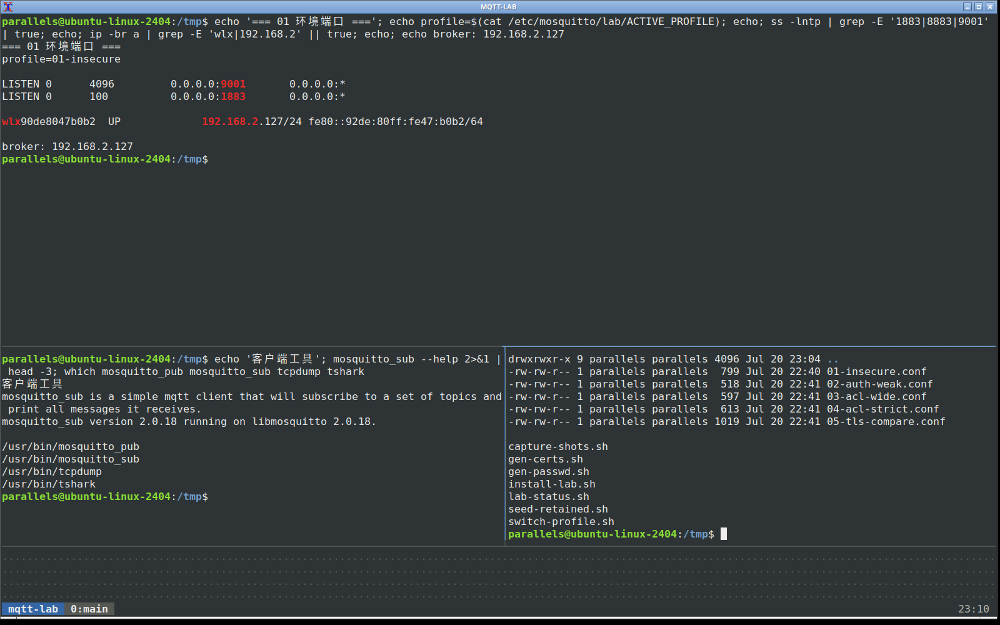

切配置用：

```sh
sudo bash lab/scripts/switch-profile.sh 01-insecure
sudo bash lab/scripts/switch-profile.sh 02-auth-weak
sudo bash lab/scripts/switch-profile.sh 03-acl-wide
sudo bash lab/scripts/switch-profile.sh 04-acl-strict
sudo bash lab/scripts/switch-profile.sh 05-tls-compare
```

五套分别干什么：

| profile | 干什么用 |
|---|---|
| `01-insecure` | 匿名 + 明文 + 无 ACL。匿名访问、扫主题、抓包、伪造、QoS、轻量 DoS |
| `02-auth-weak` | 关匿名，只剩弱口令 |
| `03-acl-wide` | 要登录，但 ACL 给了 `#`，等于白开 |
| `04-acl-strict` | 登录 + 按角色收紧主题 |
| `05-tls-compare` | 1883 明文和 8883 TLS 同时开，方便抓包对比 |

弱口令（`lab/passwd/accounts.txt`）：

```text
lab/lab  admin/admin  test/test  user/password  mqtt/mqtt
device1/device1  attacker/attacker  operator/operator
```

下面步骤默认 `HOST=192.168.2.127`。本机也可以写 `127.0.0.1`。

---

## 二、匿名访问 + 主题遍历

先切回漏洞态，并种一点“业务数据”：

```sh
sudo bash lab/scripts/switch-profile.sh 01-insecure
bash lab/scripts/seed-retained.sh
```

不带账号密码，直接订所有主题：

```sh
mosquitto_sub -h 192.168.2.127 -p 1883 -t '#' -v -W 3
```

能直接看到类似：

```text
sonoff/switch1/info {"password":"supersecret","fw":"1.0.0"}
owntracks/alice/phone {"_type":"location","lat":31.2304,"lon":121.4737}
factory/secret/token tok_abc123_do_not_leak
home/device1/status {"online":true,"temp":26.5}
```

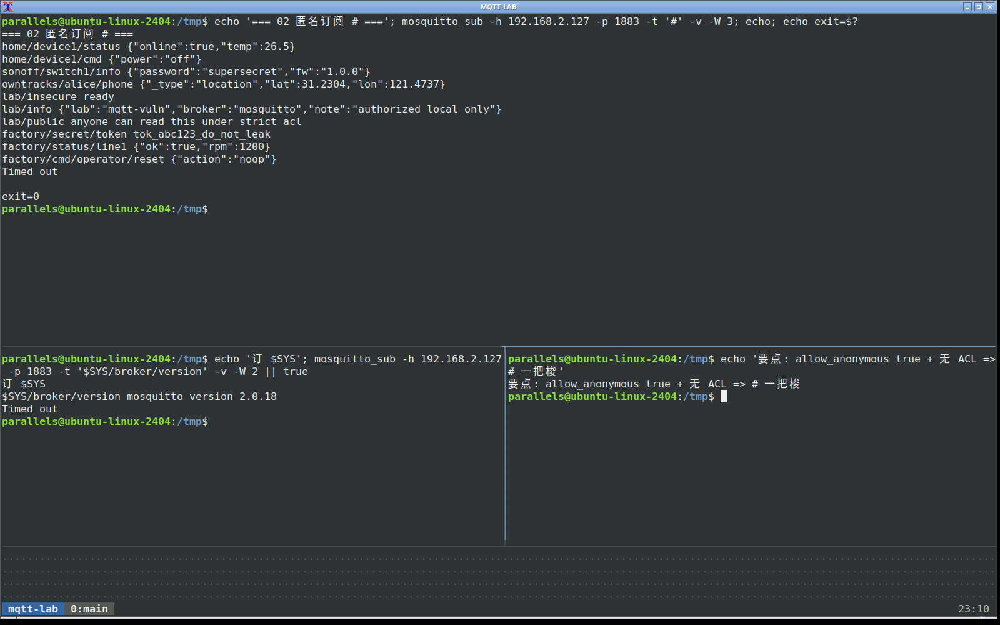

系统主题也可以扫：

```sh
mosquitto_sub -h 192.168.2.127 -p 1883 -t '$SYS/#' -v -W 3 | head
```

这里没有登录，也没有 ACL，`#` 一把梭。现实里很多“只给内网用”的 broker 就长这样：内网不等于安全。

---

## 三、用户名密码认证（对照）

### 3.1 关匿名之后

```sh
sudo bash lab/scripts/switch-profile.sh 02-auth-weak
```

再匿名：

```sh
mosquitto_sub -h 192.168.2.127 -p 1883 -t '#' -v -W 2
```

应看到：

```text
Connection error: Connection Refused: not authorised.
```

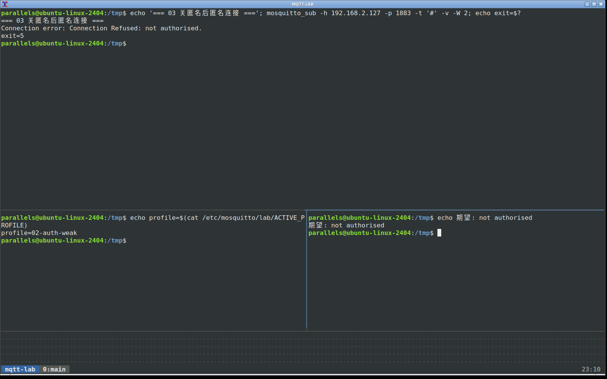

带弱口令：

```sh
mosquitto_sub -h 192.168.2.127 -p 1883 -u lab -P lab -t '#' -v -W 2
```

又能进来了。

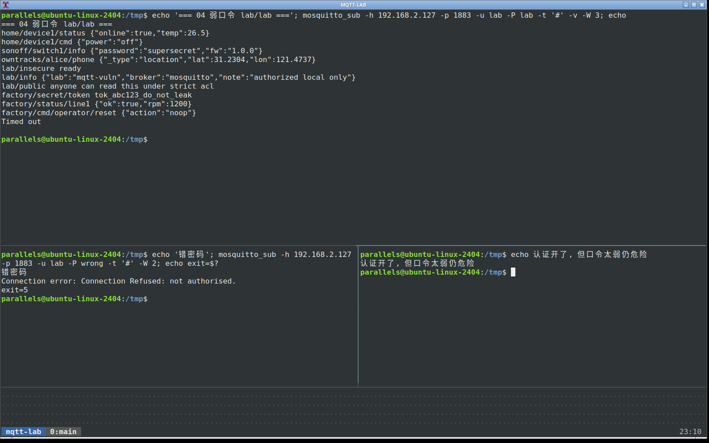

错密码同样 not authorised：

```sh
mosquitto_sub -h 192.168.2.127 -p 1883 -u lab -P wrong -t '#' -W 2
```

### 3.2 弱口令说明什么

`02-auth-weak` 只解决了“完全不认人”，没解决“口令太烂”和“登录后权限过大”。  
口令文件在 `/etc/mosquitto/lab/passwd`，明文清单在 `lab/passwd/accounts.txt`。  
写文章时可以说：认证要开，但别用 admin/admin；还要配合 ACL 和 TLS。

---

## 四、明文 MQTT 抓包

回到漏洞态。这里用带账号的连接抓，CONNECT 里才能看到用户名密码：

```sh
sudo bash lab/scripts/switch-profile.sh 01-insecure
```

一个终端抓包：

```sh
sudo tcpdump -i any -n -s 0 -w lab/pcap/plain-1883.pcap 'tcp port 1883'
```

另一个终端发一条：

```sh
mosquitto_pub -h 192.168.2.127 -p 1883 -u lab -P lab -t 'lab/demo' -m 'hello-plain-mqtt'
```

停掉 tcpdump，用 tshark 拆字段（加分隔符好看一点）：

```sh
tshark -r lab/pcap/plain-1883.pcap -Y mqtt -T fields -E separator='|' \
  -e frame.number -e mqtt.msgtype -e mqtt.topic -e mqtt.username -e mqtt.passwd -e mqtt.msg
```

`msgtype` 常见值：`1=CONNECT`，`3=PUBLISH`，`8=SUBSCRIBE`。  
本靶场实测能直接看到：

```text
4|1||lab|lab|                    ← CONNECT，username=lab，passwd=lab
8|3|lab/demo|||68656c6c6f...     ← PUBLISH，topic=lab/demo，payload 是 hex
```

payload 那段 hex 解出来就是 `hello-plain-mqtt`。  
`strings` 扫 pcap 也能直接撞上 `lab/demohello-plain-mqtt` 这种粘在一起的明文。

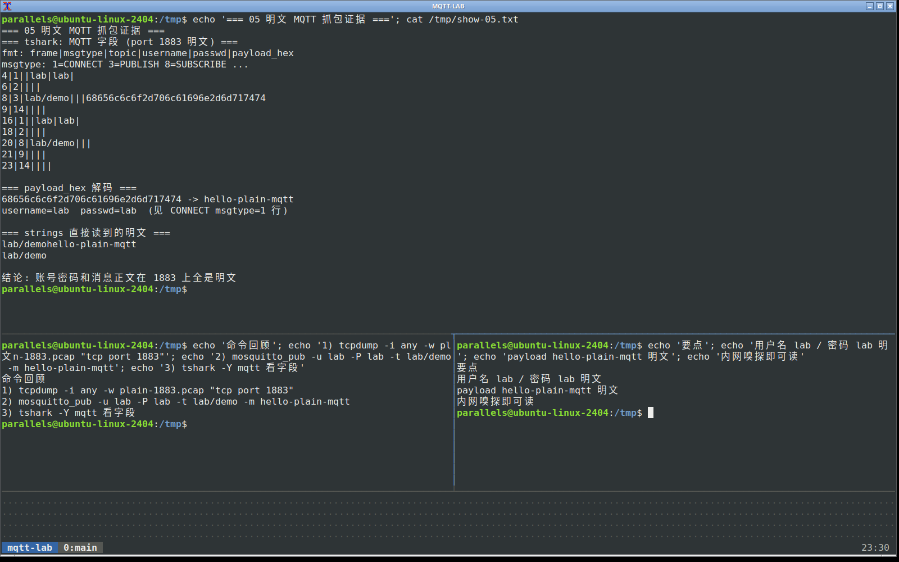

后面做 TLS 时，同一套操作改抓 `port 8883`：MQTT 字段应解不出来，只剩 TLS 记录。

---

## 五、消息伪造

漏洞态下任何人都能往控制主题灌数据。先看 seed 之后的正常值：

```sh
mosquitto_sub -h 192.168.2.127 -p 1883 -t 'home/device1/#' -v -W 2
```

正常大约是 `temp:26.5`、`power:off`：

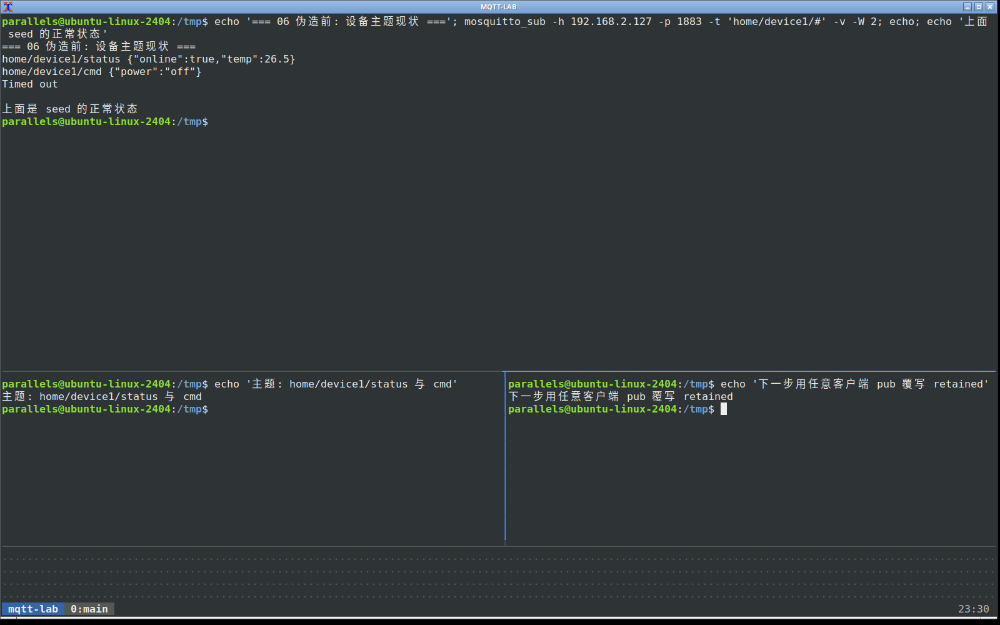

再伪造两条 retained：

```sh
mosquitto_pub -h 192.168.2.127 -p 1883 -t 'home/device1/status' -r \
  -m '{"online":true,"temp":99.9,"note":"forged-by-attacker"}'

mosquitto_pub -h 192.168.2.127 -p 1883 -t 'home/device1/cmd' -r \
  -m '{"power":"on","by":"nobody-checked-identity"}'
```

再订一次，对比会变成：

```text
home/device1/status {"online":true,"temp":99.9,"note":"forged-by-attacker"}
home/device1/cmd {"power":"on","by":"nobody-checked-identity"}
```

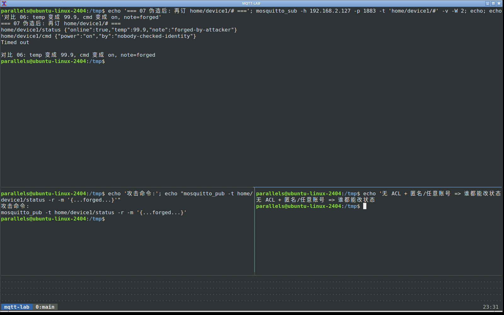

要点很直白：MQTT 默认不验证“是不是真设备发的”。没客户端证书、没应用层签名、broker 又不做 ACL，伪造就是一条 `pub`。后来的客户端连上 retained，也会吃这套假状态。

恢复演示数据：

```sh
bash lab/scripts/seed-retained.sh
```

---

## 六、ACL 过宽 vs 收紧

### 6.1 宽 ACL：有登录，照样扫全站

```sh
sudo bash lab/scripts/switch-profile.sh 03-acl-wide
MQTT_USER=lab MQTT_PASS=lab bash lab/scripts/seed-retained.sh
```

`wide.acl` 基本是每个用户 `topic readwrite #`。  
用不起眼的账号：

```sh
mosquitto_sub -h 192.168.2.127 -p 1883 -u attacker -P attacker -t '#' -v -W 3
```

仍然能读到 `factory/secret/token`、`sonoff/...password`。

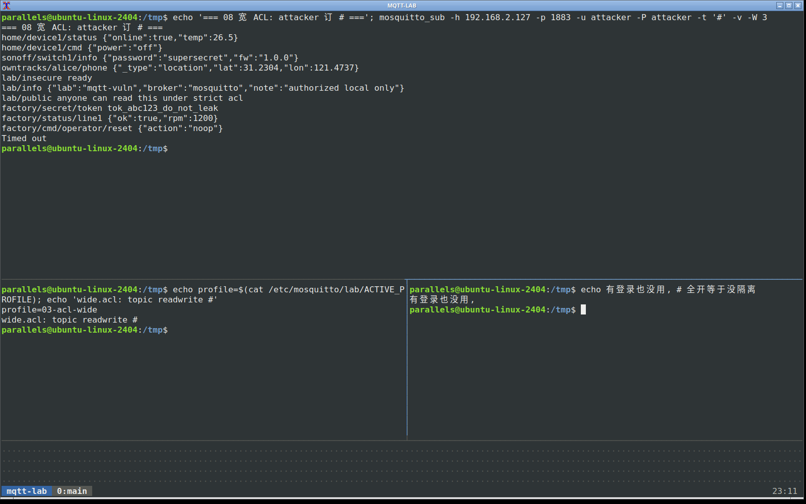

“要密码”只是第一道门。门后走廊全通，等于没隔离。

### 6.2 严 ACL：按角色砍权限

```sh
sudo bash lab/scripts/switch-profile.sh 04-acl-strict
MQTT_USER=admin MQTT_PASS=admin bash lab/scripts/seed-retained.sh
```

`device1` 只能动自己的家：

```sh
# 可以
mosquitto_pub -h 192.168.2.127 -p 1883 -u device1 -P device1 \
  -t 'home/device1/status' -m '{"online":true}' -r

# 读工厂密钥：订了也收不到（被 ACL 挡）
mosquitto_sub -h 192.168.2.127 -p 1883 -u device1 -P device1 \
  -t 'factory/secret/token' -v -W 2
```

`attacker` 在 strict 里只给了 `lab/public`：

```sh
mosquitto_sub -h 192.168.2.127 -p 1883 -u attacker -P attacker -t 'lab/public' -v -W 2
mosquitto_sub -h 192.168.2.127 -p 1883 -u attacker -P attacker -t '#' -v -W 2
```

第二条用 `#` 也扩不到别人的敏感主题。

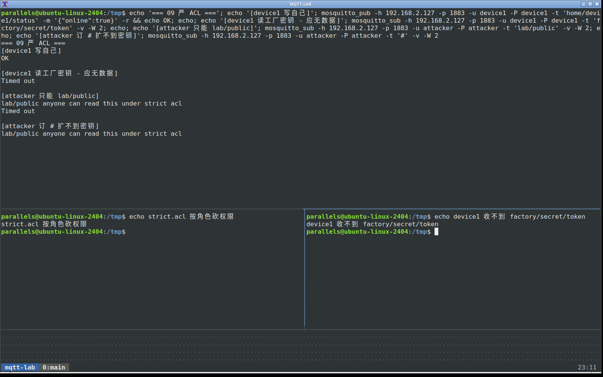

ACL 文件对照：

```text
lab/acl/wide.acl
lab/acl/strict.acl
```

---

## 七、QoS 安全比对

QoS 管的是“消息可靠不可靠”，不管“谁能看、有没有加密”。

漏洞态下发三条不同 QoS，同时抓包：

```sh
sudo bash lab/scripts/switch-profile.sh 01-insecure

sudo tcpdump -i any -n -s 0 -w lab/pcap/qos-1883.pcap 'tcp port 1883'
# 另开终端：
mosquitto_pub -h 192.168.2.127 -p 1883 -t 'lab/qos' -q 0 -m 'q0-at-most-once'
mosquitto_pub -h 192.168.2.127 -p 1883 -t 'lab/qos' -q 1 -m 'q1-at-least-once'
mosquitto_pub -h 192.168.2.127 -p 1883 -t 'lab/qos' -q 2 -m 'q2-exactly-once'
```

只看 PUBLISH（msgtype=3）的 qos 字段：

```sh
tshark -r lab/pcap/qos-1883.pcap -Y 'mqtt.msgtype==3' -T fields -E separator='|' \
  -e mqtt.msgtype -e mqtt.qos -e mqtt.topic -e mqtt.msg
```

本靶场实测三条大致是：

```text
3|0|lab/qos|71302d...   ← qos=0
3|1|lab/qos|71312d...   ← qos=1
3|2|lab/qos|71322d...   ← qos=2
```

payload 的 hex 仍能解回 `q0-at-most-once` 这类明文。也就是说：QoS 变了，内容照样裸奔。

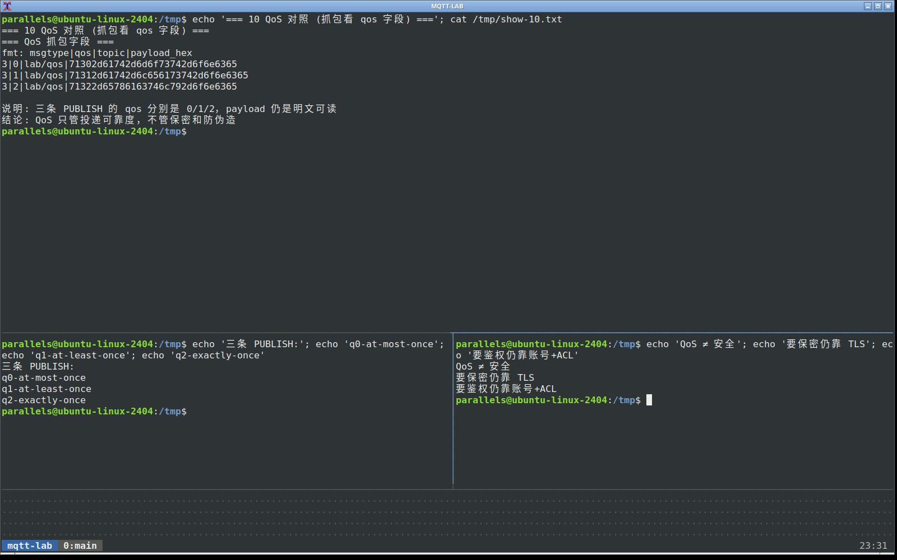

记一句就够：

```text
QoS0 最多一次，可能丢
QoS1 至少一次，可能重复
QoS2 正好一次，握手最重
三者都不提供保密、不提供防伪造
```

业务上重要指令可以抬高 QoS，但安全仍靠认证、ACL、TLS（以及应用层校验）。

---

## 八、TLS 加密对比

### 8.1 打开对照配置

```sh
sudo bash lab/scripts/switch-profile.sh 05-tls-compare
ss -lntp | grep -E '1883|8883'
```

这时 1883 和 8883 都在。账号仍是 `lab/lab`，ACL 是 strict。

客户端信任自签 CA：

```text
/usr/local/share/mqtt-lab/ca.crt
# 或
lab/certs/ca.crt
```

### 8.2 明文侧（同一账号、同一主题，走 1883）

strict ACL 下 `lab` 可以写 `lab/user/#`，所以对照主题用这个：

```sh
sudo tcpdump -i any -n -s 0 -w lab/pcap/compare-plain.pcap 'tcp port 1883'

mosquitto_pub -h 192.168.2.127 -p 1883 -u lab -P lab \
  -t 'lab/user/hello' -m 'this-is-plain'
```

```sh
tshark -r lab/pcap/compare-plain.pcap -Y mqtt -T fields -E separator='|' \
  -e mqtt.msgtype -e mqtt.topic -e mqtt.username -e mqtt.msg
strings lab/pcap/compare-plain.pcap | grep this-is-plain
```

图里能看到：端口同时监听 1883/8883；明文包里有 `lab/user/hello` 和 `this-is-plain`。

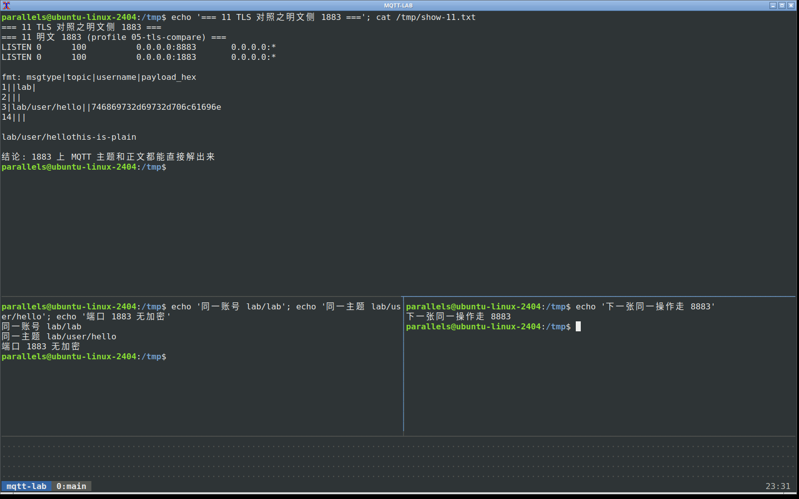

### 8.3 TLS 侧（同一账号、同一主题，走 8883）

```sh
sudo tcpdump -i any -n -s 0 -w lab/pcap/compare-tls.pcap 'tcp port 8883'

mosquitto_pub -h 192.168.2.127 -p 8883 -u lab -P lab \
  --cafile /usr/local/share/mqtt-lab/ca.crt \
  -t 'lab/user/hello' -m 'this-is-tls'
```

看包时做两件事：

```sh
# 1) 用 mqtt 过滤——应为空
tshark -r lab/pcap/compare-tls.pcap -Y mqtt

# 2) 看 tls 记录；再 strings 搜正文——应找不到 this-is-tls
tshark -r lab/pcap/compare-tls.pcap -Y tls -T fields -E separator='|' \
  -e frame.number -e tls.record.content_type | head
strings lab/pcap/compare-tls.pcap | grep this-is-tls || echo '未找到 this-is-tls 明文'
```

实测：`mqtt` 过滤空；`strings` 搜不到 `this-is-tls`；只剩 TLS 记录类型（握手 22、Application Data 等）。

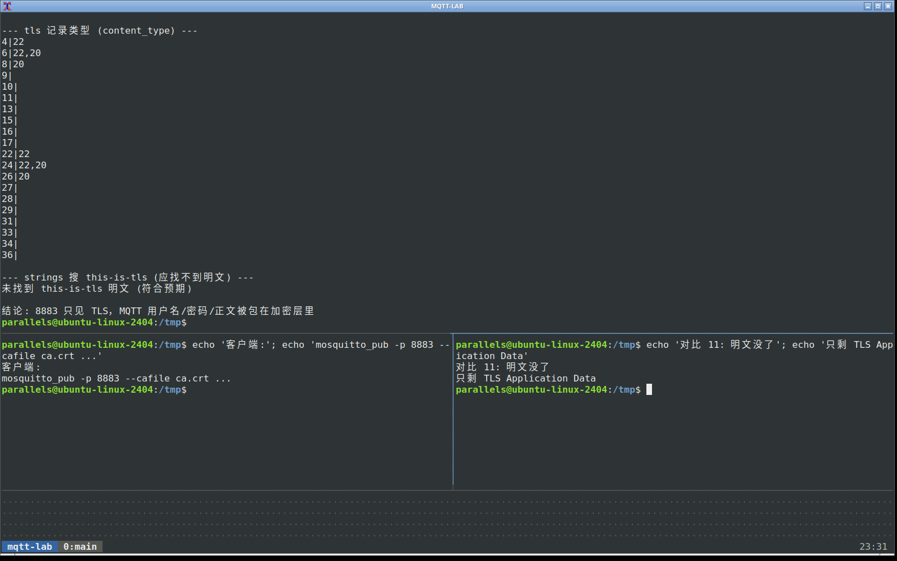

注意：TLS 管链路窃听/篡改，不自动等于“权限正确”。本 profile 故意还开着 1883 方便对比；生产应关掉明文端口。

---

## 九、简单拒绝服务观察

只在自己的靶场短时间做，边做边看 broker 日志和本机负载。

```sh
sudo bash lab/scripts/switch-profile.sh 01-insecure
# 另开窗口
sudo tail -f /var/log/mosquitto/mosquitto.log
```

### 9.1 大量连接

```sh
for i in $(seq 1 200); do
  mosquitto_sub -h 192.168.2.127 -p 1883 -t "lab/dos/$i" -W 1 >/dev/null 2>&1 &
done
wait
```

日志里会出现一串新连接；`ss -tpn | grep 1883 | wc -l` 会上去。

### 9.2 大包 / 快发

配置里漏洞态把 `max_packet_size` 拉得很大，方便观察：

```sh
# 约 100KB 负载连发
python3 - <<'PY'
import subprocess
payload = "A" * 100000
for i in range(50):
    subprocess.run([
        "mosquitto_pub","-h","192.168.2.127","-p","1883",
        "-t","lab/dos/flood","-m",payload
    ], check=False)
print("done")
PY
```

看 CPU、日志刷屏、订阅端是否卡。

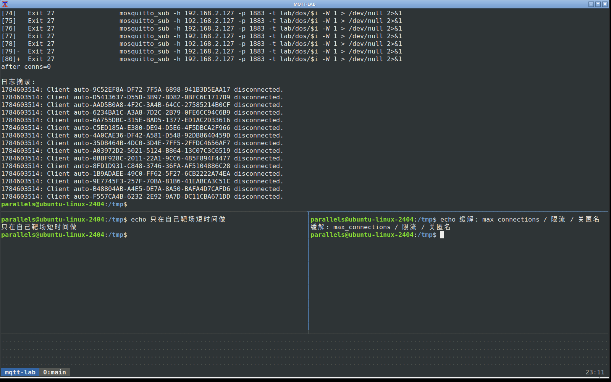

缓解方向（点到为止，本文不展开改生产配置）：

```text
限制 max_connections / max_packet_size
前面加防火墙或接入层限流
关掉匿名，缩小 ACL
监控异常连接速率
```

做完把靶场切回默认：

```sh
sudo bash lab/scripts/switch-profile.sh 01-insecure
bash lab/scripts/seed-retained.sh
```

---

## 十、怎么串成一篇完整故事

如果作业只要求 4 个实验，建议这条线：

1. 匿名 + `#` 遍历（第二节）  
2. 明文抓包（第四节）  
3. 消息伪造（第五节）  
4. 认证对照（第三节），有余力加 ACL 宽/严（第六节）

要写长文/发笔记，按本文二到九节全做即可。截图文件名已经按章节排好，都在 `shots/`：

```text
01-env-ports.png
02-anon-hash.png
03-auth-reject.png
04-auth-lab.png
05-pcap-connect.png   # 关键：明文账号+payload
06-forge-before.png
07-forge-after.png    # 关键：forged 状态
08-acl-wide.png
09-acl-strict.png
10-qos.png            # 关键：qos=0/1/2 仍明文
11-tls-plain.png      # 关键：1883 可解
12-tls-cipher.png     # 关键：8883 不可解
13-dos.png
```

补拍关键图（不占 GNOME 前台，在 Xvfb `:99`）：

```sh
export DISPLAY=:99
bash lab/scripts/capture-key-shots.sh
```

---

## 十一、加固清单（给报告结尾用）

```text
1. allow_anonymous false
2. 强口令，最好再上客户端证书
3. ACL 按设备/角色最小权限，禁止普通账号订 #
4. 生产只暴露 8883（TLS），不要对不可信网络裸奔 1883
5. 普通用户不要给 $SYS
6. 限制连接数、包大小，日志和监控跟上
7. 控制类消息在应用层再做鉴权或签名，别只信“能 pub 的就是自己人”
```

---

## 十二、常用命令速查

```sh
# 状态
bash lab/scripts/lab-status.sh
cat /etc/mosquitto/lab/ACTIVE_PROFILE

# 切换 / 种数据
sudo bash lab/scripts/switch-profile.sh 01-insecure
bash lab/scripts/seed-retained.sh

# 匿名扫主题
mosquitto_sub -h 192.168.2.127 -p 1883 -t '#' -v -W 3

# 带账号
mosquitto_sub -h 192.168.2.127 -p 1883 -u lab -P lab -t '#' -v -W 3
mosquitto_pub -h 192.168.2.127 -p 1883 -u lab -P lab -t 'lab/x' -m 'hi'

# TLS
mosquitto_sub -h 192.168.2.127 -p 8883 -u lab -P lab \
  --cafile /usr/local/share/mqtt-lab/ca.crt -t 'lab/#' -v -W 3

# 抓包
sudo tcpdump -i any -n -s 0 -w lab/pcap/x.pcap 'tcp port 1883'
tshark -r lab/pcap/x.pcap -Y mqtt
```

---

## 十三、环境自检结果（搭建时已跑通）

| 检查项 | 结果 |
|---|---|
| `01-insecure` 匿名 `#` | 可读 retained 敏感主题 |
| `02-auth-weak` 匿名 | `not authorised` |
| `02-auth-weak` lab/lab | 可订阅 |
| `03-acl-wide` attacker + `#` | 仍可读 `factory/secret/token` |
| `04-acl-strict` device1 写自己主题 | 成功 |
| `04-acl-strict` device1 读工厂密钥 | 收不到 |
| `05-tls-compare` 8883 + ca.crt | 收发正常 |
| 默认回到 `01-insecure` | 已恢复，便于后续截图 |

当前默认：

```text
profile = 01-insecure
listen  = 0.0.0.0:1883 , 0.0.0.0:9001
seed    = 已写入 lab/ factory/ home/ sonoff/ owntracks/ 等 retained
```
